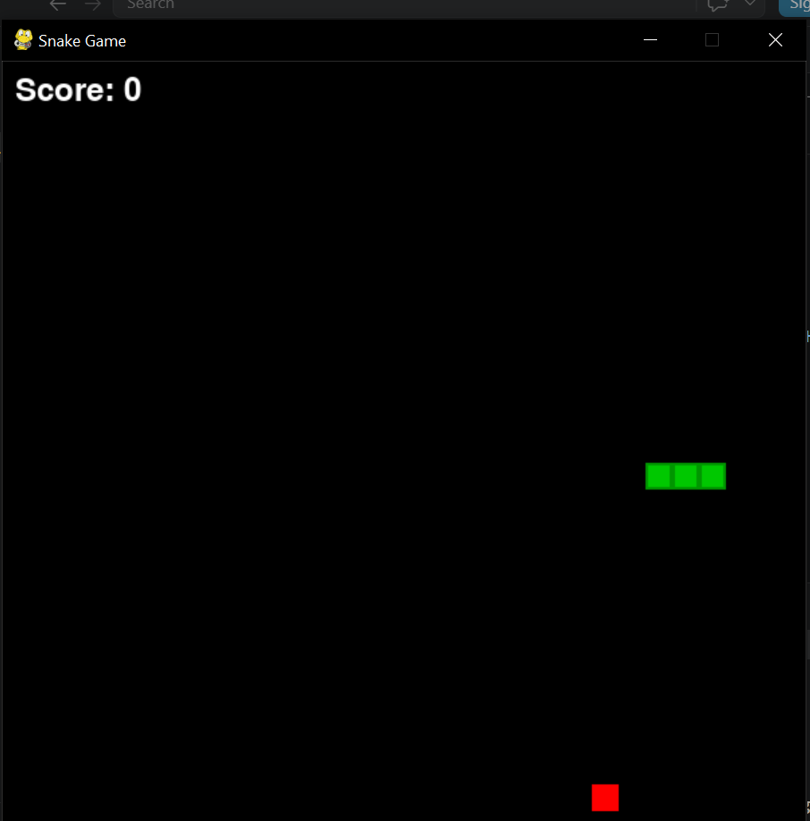
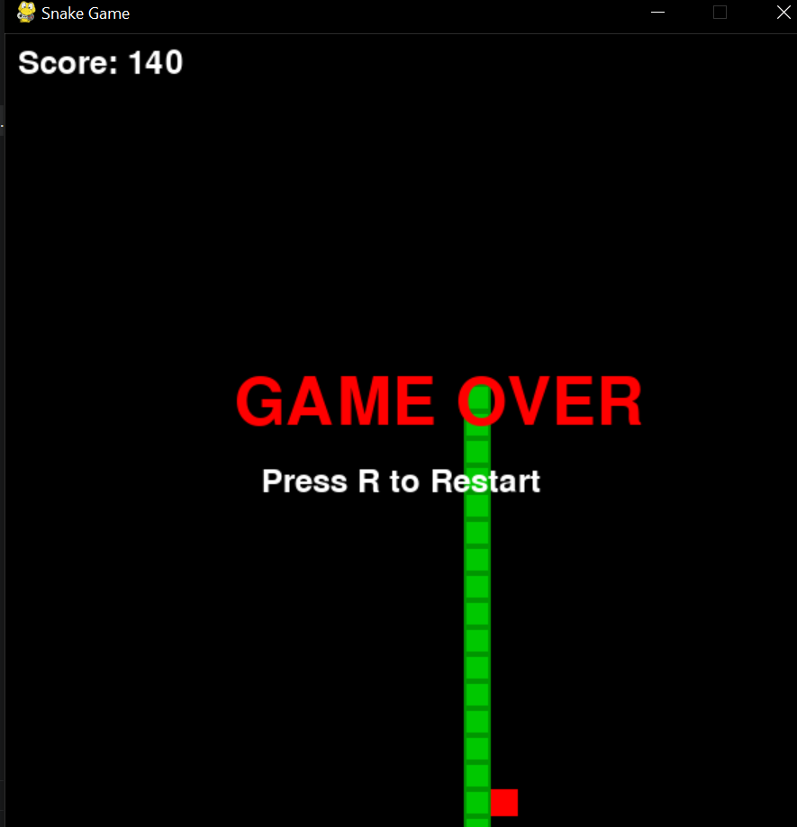

<div align="center">

# 🐍 Classic Snake Game
### Built with Python & Pygame | Object-Oriented Programming


*A semester project demonstrating real-world application of Object-Oriented Programming principles through game development.*

</div>

---

## 👩‍💻 Developer

| Field | Details |
|---|---|
| **Name** | Faiza |
| **Roll No** | F24-1783 |
| **Program** | BS Artificial Intelligence |
| **Semester** | 4th Semester — Section D |
| **Department** | Information Technology |
| **University** | University of Haripur |

---

## 📖 About This Project

This is a fully functional **Classic Snake Game** built from scratch using Python and Pygame. Every part of the game — from the snake's movement to food spawning and collision detection — is structured using proper **Object-Oriented Programming (OOP)** design.

The goal was not just to build a working game, but to apply the OOP concepts studied this semester in a meaningful, real-world way. The result is clean, organized, and readable code that demonstrates how abstract thinking translates into actual software.

---

## 🎮 Game Features

- 🟢 Snake moves smoothly in all 4 directions
- 🍎 Food spawns randomly — never on the snake's body
- 📈 Snake grows longer with every food eaten
- 🧮 Score increases by **+10 points** per food
- ⚡ Speed increases automatically as score grows
- 💥 Wall collision detection — game ends on contact
- 🔄 Self-collision detection — snake cannot cross itself
- 🎯 Game Over screen with final score display
- ▶️ Press **R** to restart instantly

---

## 🧠 OOP Concepts Applied

| Concept | Implementation |
|---|---|
| **Abstract Class** | `GameObject` — base class that cannot be used directly |
| **Inheritance** | `Segment` and `Food` both inherit from `GameObject` |
| **Polymorphism** | Both classes override `draw()` with different behavior |
| **Encapsulation** | All game logic is contained inside `SnakeGame` class |
| **Properties** | `rect` property defined once, reused by all child classes |

---

## 🏗️ Project Structure

```
snake-game-python/
│
├── snake_game.py        ← Main game file (all code here)
├── requirements.txt     ← Python dependencies
├── README.md            ← Project documentation
├── PROJECT_REPORT.md    ← Full academic report with class diagram
├── CONTRIBUTING.md      ← Contribution guidelines
├── CHANGELOG.md         ← Version history
├── LICENSE              ← MIT License
└── screenshots/
    ├── gameplay.png     ← Game in action
    └── gameover.png     ← Game Over screen
```

---

## 🛠️ Tech Stack

| Tool | Purpose |
|---|---|
| **Python 3.x** | Core programming language |
| **Pygame 2.5.2** | Game graphics and event handling |
| **VS Code** | Development environment |
| **ABC Module** | Abstract base class implementation |

---

## ▶️ How to Run

**Step 1 — Clone the repository**
```bash
git clone https://github.com/YOUR_USERNAME/snake-game-python.git
cd snake-game-python
```

**Step 2 — Install dependency**
```bash
pip install pygame
```

**Step 3 — Run the game**
```bash
python snake_game.py
```

---

## 🎯 Controls

| Key | Action |
|---|---|
| ⬆️ Arrow Up | Move Up |
| ⬇️ Arrow Down | Move Down |
| ⬅️ Arrow Left | Move Left |
| ➡️ Arrow Right | Move Right |
| **R** | Restart after Game Over |

---

## 📸 Screenshots

### 🟢 Gameplay — Snake in Action


---

### 💥 Game Over Screen (Score: 140)


---

## 🔮 Future Improvements

- [ ] 🔊 Sound effects and background music
- [ ] 🏆 High score saving system
- [ ] 🎚️ Difficulty levels — Easy / Medium / Hard
- [ ] 🎨 Colorful snake skins and themes
- [ ] 📱 Start menu with game instructions
- [ ] 🌐 Two-player mode

---

## 📊 Project Stats

```
Language        →  Python
Library         →  Pygame
Total Classes   →  4 (GameObject, Segment, Food, SnakeGame)
OOP Concepts    →  5 (Abstract, Inheritance, Polymorphism, Encapsulation, Properties)
Lines of Code   →  ~155 lines
Project Type    →  Semester Project (BS AI — 4th Semester)
Status          →  ✅ Completed
```

---

## 📋 Project Status

✅ **Completed** as a Semester Project — BS Artificial Intelligence, University of Haripur

---

## 📄 License

This project is created for **educational purposes** as part of the BS AI curriculum.
See the [LICENSE](LICENSE) file for details.

---

<div align="center">

*Made with 💚 and Python by Faiza — University of Haripur*

</div>
